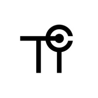

# AI-Powered Crime Scene Camera Detector

  
  &nbsp;&nbsp;&nbsp;
  
  

This project explores an AI-powered camera detection system for crime scene investigations. When officers arrive at a crime scene, one of the first and most time-sensitive tasks is finding nearby civilian surveillance cameras that may have captured the incident. Today, this process is often manual: officers walk the scene perimeter, scan buildings, knock on doors, and try to locate footage before it is overwritten.

The Crime Scene Camera Detector proposes a faster computer vision workflow that identifies whether images contain civilian surveillance cameras. The goal is to reduce hours of manual searching into minutes, helping investigators preserve the critical "golden hours" after an incident.

## Live Web App (GitHub Pages)

The `docs/` folder contains a static web app that turns this project into a
field tool. It runs entirely in the browser (works on laptops and mobile
phones) and:

- opens the device camera (rear camera on phones) and shows a live feed,
- runs the camera classifier on the feed — either **on-device** with the
  YOLOv8 model via ONNX Runtime Web, or through the project's
  **Roboflow-hosted** model as a fallback,
- tracks the device's GPS position with the browser Geolocation API,
- when a surveillance camera is confirmed in the feed, drops a pin on a live
  OpenStreetMap map at the current GPS coordinates together with a snapshot
  of what was detected, its confidence, timestamp, and GPS accuracy,
- de-duplicates repeat detections of the same camera (configurable radius),
  supports manual pins, persists sightings on the device, and exports
  everything as **GeoJSON** or **CSV** for GIS tools.

### Enabling it

1. Merge this branch to `main`.
2. On GitHub: **Settings → Pages → Source: Deploy from a branch →
   Branch: `main`, folder: `/docs`** → Save.
3. Open `https://<your-username>.github.io/CameraDetector/` — allow camera
   and location access when prompted (GitHub Pages is HTTPS, which both
   permissions require).

### Getting detections working

The app supports two backends (switchable in ⚙ Settings):

| Backend | What it needs | Privacy |
| --- | --- | --- |
| On-device ONNX (recommended) | Export your trained `best.pt` to ONNX and commit it as `docs/models/camera-classifier.onnx` — see [`docs/models/README.md`](docs/models/README.md). The repo currently only holds the *base ImageNet* weights, not the trained classifier. | Frames never leave the device |
| Roboflow API | Enter the model id (`camerav2-u58ps/2`) and an API key in ⚙ Settings | Frames are uploaded to Roboflow |

> ⚠️ **Security note:** a Roboflow private API key is currently hardcoded in
> `Roboflow/main.py` and is public in this repository's history. Rotate it in
> your Roboflow workspace settings, and use a *publishable* key for the web
> app.

## Project Context

Civilian surveillance footage can be decisive evidence, but officers first need to know where the cameras are, who owns them, and whether they cover the crime scene. This project focuses on the AI model component of that problem.

The system is designed around the following operational needs:

- High recall, because missing a real camera is more harmful than checking a false alarm.
- Reasonable precision, so officers do not lose trust in the system.
- Fast inference, so the system is meaningfully quicker than manual search.
- Robust performance across varied environments, lighting conditions, mounting positions, and camera types.
- Deployment flexibility for future use on field devices without relying on constant internet access.

## Dataset

The dataset was built for binary image classification with two classes:

- `Camera`
- `No Camera`

Images were collected from public datasets and image repositories, including camera-focused datasets and broader non-camera sources such as COCO, Open Images, and Roboflow Universe datasets. The non-camera class includes varied subjects such as people, food, animals, vehicles, sports scenes, hallways, and other environments.

### Dataset Size

| Stage | Camera Images | No Camera Images | Total |
| --- | ---: | ---: | ---: |
| Before augmentation | 2,422 | 2,652 | 5,074 |
| After augmentation | 13,500 | 13,500 | 27,000 |

### Dataset Split

| Split | Percentage | Images |
| --- | ---: | ---: |
| Training | 70% | 18,900 |
| Validation | 20% | 5,400 |
| Test | 10% | 2,700 |

### Augmentation

To improve generalization and reduce overfitting, the dataset was expanded through augmentation. The technical report lists the following transformations:

- Horizontal and vertical flipping
- 90-degree rotations
- Rotation within +/-15 degrees
- Brightness adjustment of +/-25%
- Exposure adjustment of +/-15%
- Noise up to 2%
- Saturation adjustment of +/-30%
- Perspective transformation
- Grayscale conversion

## Models Compared

Two model pipelines were trained and evaluated on the same camera detection problem.

| Model | Description |
| --- | --- |
| YOLOv8 Medium | A locally configured Ultralytics YOLOv8 Medium classification model, selected for flexibility and ONNX export support. |
| Roboflow ResNet50 | A cloud-managed Roboflow classification model using transfer learning with a ResNet50 backbone. |

The purpose of comparing both models was not only to measure raw accuracy, but also to evaluate practical suitability for real-world law enforcement deployment.

## Evaluation Results

### Automated Dataset Evaluation

Both models were evaluated on a 2,700-image test set.

| Metric | Roboflow ResNet50 | YOLOv8 Medium |
| --- | ---: | ---: |
| Total test images | 2,700 | 2,700 |
| Correct predictions | 2,649 | 2,213 |
| Accuracy | 98.11% | 82.0% |
| Precision | 97.51% | 84.9% |
| Recall | 98.74% | 82.0% |
| F1 score | 98.12% | 81.6% |

On the controlled dataset evaluation, the Roboflow ResNet50 model performed significantly better, with only 51 incorrect predictions out of 2,700 images.

### Manual Real-World Testing

Both models were also tested on 12 manually selected real-world images, including cameras and unrelated objects such as athletes, animals, a car, a food bucket, and a hallway.

| Model | Manual Test Result |
| --- | ---: |
| Roboflow ResNet50 | 10/12 |
| YOLOv8 Medium | 12/12 |

The manual test results reversed the automated ranking. YOLOv8 Medium correctly classified all 12 images, while Roboflow produced two false positives by classifying a car and a KFC bucket as cameras.

### Manual Test Confidence Comparison

| Test Subject | Roboflow Confidence | YOLOv8 Confidence |
| --- | ---: | ---: |
| Ronaldo | 77.7% | 100.0% |
| Camera | 99.7% | 100.0% |
| Cat | 69.5% | 100.0% |
| Dog | 53.5% | 100.0% |
| Camera | 99.6% | 100.0% |
| Messi | 99.4% | 100.0% |
| Elon Musk | 98.8% | 100.0% |
| Car | 59.7% | 100.0% |
| KFC Bucket | 51.5% | 89.0% |
| Hallway | 98.4% | 99.5% |
| Camera 2 | 99.6% | 99.8% |
| Camera 3 | 99.6% | 100.0% |

## Key Findings

The evaluation produced an important contrast:

- Roboflow ResNet50 achieved the stronger automated dataset metrics.
- YOLOv8 Medium performed better on the manual out-of-distribution test.
- Roboflow's manual errors were low-confidence false positives, suggesting confidence thresholding could reduce mistakes.
- YOLOv8 Medium showed a bias toward flagging possible cameras, which creates more false positives but fewer missed cameras.
- For law enforcement use, false positives are usually less damaging than false negatives because missed cameras can mean lost evidence.

## Recommendation

The technical report recommends YOLOv8 Medium as the primary deployment model.

Although Roboflow achieved higher automated test accuracy, YOLOv8 Medium is considered more suitable for the intended field scenario because it:

- Performed best on the manual real-world test.
- Can be exported through ONNX.
- Is easier to run independently of a cloud-managed platform.
- Is better suited for future edge deployment on local field devices.

## Limitations

The current system is still a binary classifier. It can determine whether an image contains a camera, but it does not yet:

- Draw bounding boxes around camera locations.
- Count multiple cameras in a single image.
- Identify the camera type.
- Process live video streams.
- Plot detected cameras onto a live map.

The report also notes that the dataset should be expanded further to cover more lighting conditions, camera designs, mounting angles, and real-world environments.

## Future Work

Planned improvements include:

- Moving from image classification to full object detection.
- Training YOLOv8 to draw bounding boxes around each detected camera.
- Supporting multiple cameras in one image.
- Integrating detections with a GIS or live map system.
- Processing live video from body cameras, dashcams, or drones.
- Optimizing the model for local use on rugged field tablets.
- Creating a feedback loop so real-world mistakes can improve later model versions.

## Project Materials

This README is based on the project materials:

- `technical_report.docx`
- `poster.pdf`
